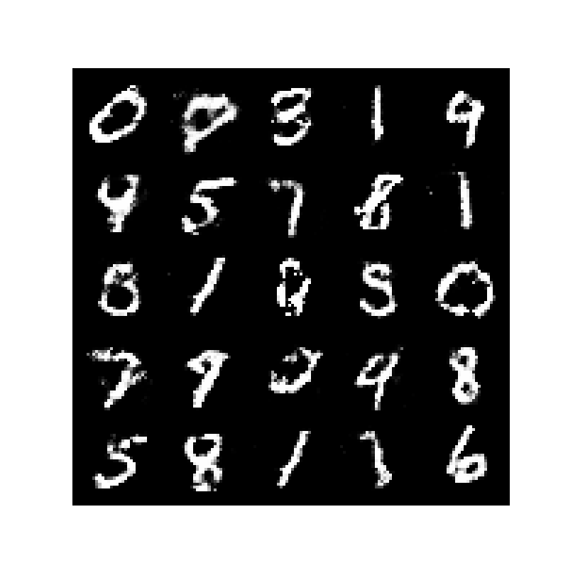

# SimpleGAN on MNIST

Welcome to the SimpleGAN project! This repository contains a basic implementation of a Generative Adversarial Network (GAN) trained on the MNIST dataset to generate images of handwritten digits. The goal of this project is to provide a clear and concise example of how a simple GAN works, making it accessible for those who are new to generative models or looking to reinforce their understanding.

## Overview

Generative Adversarial Networks (GANs) are a class of neural networks that can generate new data samples that resemble the training data. In this project, the GAN is trained on the MNIST dataset, which consists of 28x28 pixel images of handwritten digits (0-9). The SimpleGAN consists of two main components:

- **Generator:** This network takes random noise as input and generates an image.
- **Discriminator:** This network attempts to distinguish between real images (from the MNIST dataset) and fake images generated by the Generator.

The two networks are trained together in a game-like scenario where the Generator tries to fool the Discriminator, and the Discriminator tries not to be fooled.

## Getting Started

### Prerequisites

To run this project, you'll need the following libraries:

- Python 3.8-3.11
- PyTorch
- Matplotlib
- Jupyter notebook

You can install the required packages using pip:

```bash
pip install torch torchvision torchaudio --index-url https://download.pytorch.org/whl/cu124
pip install matplotlib
pip install notebook
```

### Running the Project

1. **Clone the repository:**

   ```bash
   git clone https://github.com/inventwithdean/SimpleGAN.git
   cd SimpleGAN
   ```

2. **Run the Notebook:**

   You can run it using:

   ```bash
   jupyter notebook ./first_gan.ipynb
   ```

  Run all the cells and the notebook will take care of training and will save the generated images at regular intervals.

3. **View the Results:**

   After training, you can view the final generated images stored in the same directory. These images represent the digits generated by the GAN after final training.

### Example Output

Here’s an example of what the SimpleGAN can generate after training:



## Understanding the Code

The code in this repository is designed to be as simple and educational as possible. The `first_gan.ipynb` file contains the main implementation of the GAN as well as training it.

If you're new to GANs, I encourage you to read through the code, tweak the parameters, and see how it affects the results. This hands-on approach is one of the best ways to learn.

## Conclusion

SimpleGAN is a great starting point for anyone interested in exploring the world of GANs. Whether you're a beginner or just looking for a clear example to study, this project provides the foundation you need to understand how GANs work.

Feel free to fork this repository, experiment with the code, and share your results!

## Contact

If you have any questions or suggestions, feel free to reach out or create an issue in the repository.

## License

This project is licensed under the MIT License.
